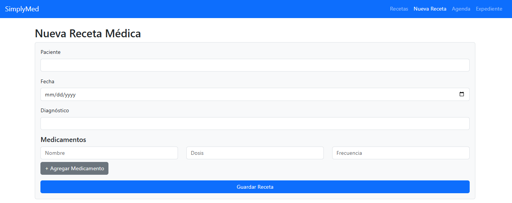

# 🩺 SimplyMed – Aplicación de Recetas Médicas

Aplicación web tipo SPA desarrollada con React que permite a pacientes registrar, visualizar y gestionar sus recetas médicas. Se conecta a una aplicación de consola en Java para manejar la lógica de persistencia de datos en diferentes formatos.

---

## 🚀 Tecnologías Utilizadas

| Capa          | Tecnología              |
|---------------|--------------------------|
| Frontend      | React + Vite             |
| Backend       | Java Standard Edition    |
| Persistencia  | Archivos JSON, CSV, binario|
| Build Tool    | Maven                    |
| Routing       | React Router DOM         |
| Estado global | Context API + Reducer    |
| Estilos       | Bootstrap + CSS Modules  |
| Testing       | Vitest + Testing Library |
| Portals       | ReactDOM.createPortal    |
| Librerias Java| Gson                     |

---

## 💻 Arquitectura del Proyecto
El proyecto se compone de dos módulos principales:

1. react-client/ (Frontend): La aplicación de interfaz de usuario, construida con React.

2. java-client/ (Backend/Consola): Una aplicación de consola en Java que gestiona la persistencia de datos.

La comunicación entre el frontend y el backend se realiza a través de la manipulación de archivos JSON. El frontend genera un archivo JSON con los datos de las recetas, que luego puede ser procesado por la aplicación de consola de Java para su almacenamiento o exportación como JSON o binario.

---
## 🧩 Funcionalidades Implementadas

### Aplicacion Web (Frontend)
- SPA completa con rutas: `/`, `/recetas`, `/nueva`, `/agenda`, `/expediente`, `404`
- Formulario controlado para nueva receta médica
- Renderizado dinámico de recetas desde contexto global
- Modal con Portal para ver receta completa
- Agenda de medicamentos agrupados por fecha y paciente
- Expediente clínico con estadísticas básicas
- Navegación global (`Navbar`) usando `Link` y `NavLink`

### Aplicacion de Consola (Backend)
- Importar datos: Carga recetas desde archivos JSON.
- Merge de datos: Fusiona recetas importadas con la lista existente, actualizando las existentes por ID.
- Listar: Muestra todas las recetas almacenadas en memoria.
- Exportar: Guarda las recetas en archivos JSON y CSV.
- Persistencia: Almacena y carga el estado de la aplicación en archivos binarios (.dat).
- Manejo de errores: Implementación de un timeout en la exportación a JSON para evitar bloqueos.

---
### Documentacion
  

---
## 📷 Capturas

### 📄 Lista de Recetas


### 📆 Agenda de Medicamentos


### 🧾 Expediente Clínico


### 🧾 Nueva receta


---

## 🧪 Pruebas Unitarias

- Se utilizó **Vitest** con entorno `jsdom` para simular navegador
- Configuración en `vite.config.js`:
```js
test: {
  environment: 'jsdom',
  setupFiles: './vitest.setup.js'
}
```

### Pruebas implementadas

- ✅ `RecetaCard.test.jsx`: Verifica renderizado de receta con props
- ✅ `NuevaReceta.test.jsx`: Simula llenado del formulario y llama `agregarReceta` con `vi.fn()`

---

## 📦 Scripts útiles

```bash
# Frontend
npm run dev     # Inicia el servidor local para la app web
npm run build   # Compila para producción
npm run test    # Ejecuta pruebas unitarias

# Backend (Java)
mvn compile
mvn exec:java -Dexec.mainClass="com.simplymed.client.App"
```

---

## 📅 Bitácora del Desarrollo

> Última actualización: 2025-08-9 12:25:42

- Fase 1: Setup con Vite, React y rutas SPA
- Fase 2: Lista de recetas con `.map()` y mock
- Fase 3: Formulario con `useState`, validaciones
- Fase 4: Manejo global con Context + Reducer
- Fase 5: Modal con Portals
- Fase 6: Agenda de medicamentos
- Fase 7: Navbar y Links
- Fase 8: Vista de expediente clínico
- Fase 9: Custom hook `useRecetas`
- Fase 10: Testing unitario con mocks y `jest-dom`
- Fase 11: Aplicacion en Java para improtar/exportar recetas 

---

## 🧠 Autor

* Antonio Fonseca Alvarado: https://github.com/FonseAntoIM
* Brenda Karen Gomez Flores: https://github.com/Brenda-KGF

Proyecto final - Módulo 4 JAVA / BEDU / 2025

---
