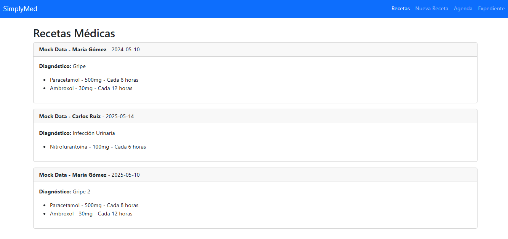
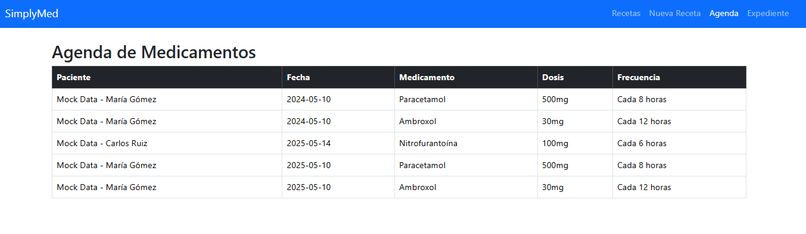
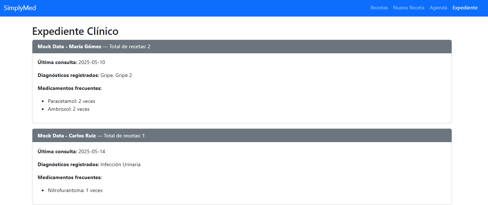

# 🩺 SimplyMed – Aplicación de Recetas Médicas

Aplicación web tipo SPA desarrollada con React que permite a pacientes registrar, visualizar y gestionar sus recetas médicas, así como ver un expediente clínico resumido y una agenda de medicamentos a tomar.

---

## 🚀 Tecnologías Utilizadas

| Capa          | Tecnología              |
|---------------|--------------------------|
| Frontend      | React + Vite             |
| Routing       | React Router DOM         |
| Estado global | Context API + Reducer    |
| Estilos       | Bootstrap + CSS Modules  |
| Testing       | Vitest + Testing Library |
| Portals       | ReactDOM.createPortal    |

---

## 🧩 Funcionalidades Implementadas

- SPA completa con rutas: `/`, `/recetas`, `/nueva`, `/agenda`, `/expediente`, `404`
- Formulario controlado para nueva receta médica
- Renderizado dinámico de recetas desde contexto global
- Modal con Portal para ver receta completa
- Agenda de medicamentos agrupados por fecha y paciente
- Expediente clínico con estadísticas básicas
- Navegación global (`Navbar`) usando `Link` y `NavLink`

---

## 📷 Capturas

### 📄 Lista de Recetas


### 📆 Agenda de Medicamentos


### 🧾 Expediente Clínico


---

## 🧪 Pruebas Unitarias

- Se utilizó **Vitest** con entorno `jsdom` para simular navegador
- Configuración en `vite.config.js`:
```js
test: {
  environment: 'jsdom',
  setupFiles: './vitest.setup.js'
}
```

### Pruebas implementadas

- ✅ `RecetaCard.test.jsx`: Verifica renderizado de receta con props
- ✅ `NuevaReceta.test.jsx`: Simula llenado del formulario y llama `agregarReceta` con `vi.fn()`

---

## 📦 Scripts útiles

```bash
npm run dev     # Inicia el servidor local
npm run build   # Compila para producción
npm run test    # Ejecuta pruebas unitarias
```

---

## 📅 Bitácora del Desarrollo

> Última actualización: 2025-05-17 11:01:42

- Fase 1: Setup con Vite, React y rutas SPA
- Fase 2: Lista de recetas con `.map()` y mock
- Fase 3: Formulario con `useState`, validaciones
- Fase 4: Manejo global con Context + Reducer
- Fase 5: Modal con Portals
- Fase 6: Agenda de medicamentos
- Fase 7: Navbar y Links
- Fase 8: Vista de expediente clínico
- Fase 9: Custom hook `useRecetas`
- Fase 10: Testing unitario con mocks y `jest-dom`

---

## 🧠 Autor

* Antonio Fonseca Alvarado: https://github.com/FonseAntoIM
* Brenda Karen Gomez Flores: https://github.com/BrendaGF

Proyecto final - Módulo React / BEDU / 2025

---
